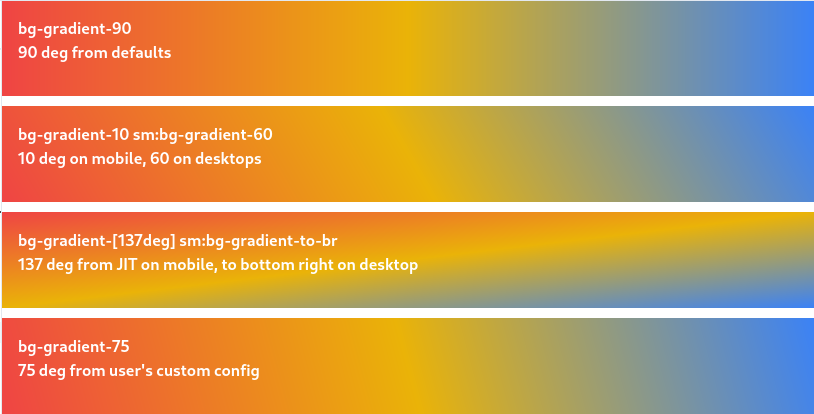

# TailwindCSS gradients

TailwindCSS plugin that allows using degrees in CSS gradients



## Installation

Install the plugin

Npm:

```sh
npm install tailwindcss-gradient
```

Yarn:

```sh
yarn add tailwindcss-gradient
```

Pnpm:

```sh
pnpm add tailwindcss-gradient
```

Bun:

```sh
bun add tailwindcss-gradient
```

Add plugin to your `tailwind.config.js` plugins

```js
// tailwind.config.js

module.exports = {
    plugins: [
        require('tailwindcss-gradient'),
    ],
}
```

## Usage

Use it as `bg-gradient-{degrees}` utility to specify linear gradient angle

```html
<div class="h-40 from-red-500 to-blue-500 bg-gradient-90">
    90 deg gradient direction
</div> 
```

List of available default utilities:

- `bg-gradient-0`
- `bg-gradient-10`
- `bg-gradient-15`
- `bg-gradient-20`
- `bg-gradient-25`
- `bg-gradient-30`
- `bg-gradient-45`
- `bg-gradient-60`
- `bg-gradient-90`
- `bg-gradient-120`
- `bg-gradient-135`
- `bg-gradient-180`

Each will generate CSS like `background-image: linear-gradient($value, var(--tw-gradient-stops))`

### Alias

Since v1.1.0 every utility available under `bg-gradient-to` alias, e.g. `bg-gradient-to-45` is same as `bg-gradient-45` - it just make more sense as it points direction

## Configuration

```js
// tailwind.config.js
module.exports = {
    theme: {
        extend: {
            bgGradientDeg: {
                75: '75deg',
            }
        }
    },
}
```

## Example

```html
<div class="h-40 from-red-500 via-yellow-500 to-blue-500 bg-gradient-90">
    90 deg from defaults
</div> 

<div class="h-40 from-red-500 via-yellow-500 to-blue-500 bg-gradient-10 sm:bg-gradient-60">
    10 deg on mobile,
    60 on desktops
</div> 

<div class="h-40 from-red-500 via-yellow-500 to-blue-500 bg-gradient-[137deg] sm:bg-gradient-to-br">
    137 deg from JIT on mobile,
    to bottom right on desktop
</div> 

<div class="h-40 from-red-500 via-yellow-500 to-blue-500 bg-gradient-75">
    75 deg from user's custom config
</div>
```


